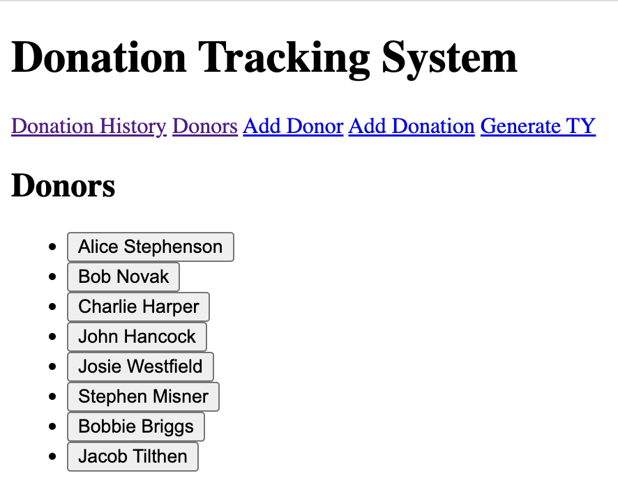

# Donation Tracking System

Web application allowing non-profits to keep track of donations and donors.

## Pages / Functionality

- Homepage: displays all donations
- All donors page
- Donor detail page
- Add donor
- Add donation
- Generate thank you note for last donation

## Technologies Used

Python, Flask, Jinja2 and PostgreSQL. Deployed to Heroku.

## Frontend

Homepage:

All donors page:

Donor detail page:

Add donor:

Add donation:

Generate thank you note, referencing most recent donation:

